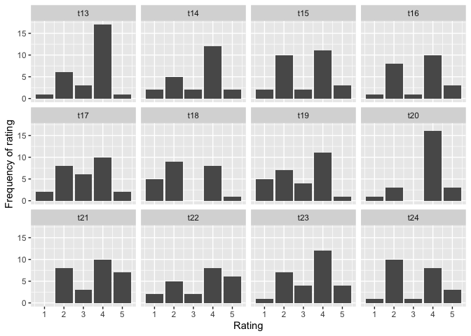

Word order constraints on event-internal modifiers - Experiment 1:
Likert Scale study on Anaphoricity
================
Tibor Kiss
09.09.2021

``` r
library(ordinal)
library(tidyverse)
library(emmeans)

show(version)
```

    ##                _                           
    ## platform       x86_64-w64-mingw32          
    ## arch           x86_64                      
    ## os             mingw32                     
    ## system         x86_64, mingw32             
    ## status                                     
    ## major          4                           
    ## minor          1.2                         
    ## year           2021                        
    ## month          11                          
    ## day            01                          
    ## svn rev        81115                       
    ## language       R                           
    ## version.string R version 4.1.2 (2021-11-01)
    ## nickname       Bird Hippie

#### Introduction

This document describes the necessary analysis of Experiment 1 (LS) for
event-internal modifiers (second stage). We include a model with and
without interaction. As can be seen below, the difference between the
two models in terms of fit is just above 0.05.

#### Read in data set

``` r
exp_anaphoricity_ls.test.data <- 
  read.csv("../Data/LikertSkala_test.csv", fileEncoding = "UTF-8", stringsAsFactors = TRUE)

exp_anaphoricity_ls.test.data$CONDITION_NO <- factor(exp_anaphoricity_ls.test.data$CONDITION_NO)

exp_anaphoricity_ls.test.data$FCT_ANSWER <- 
  factor(exp_anaphoricity_ls.test.data$ANSWER, ordered = TRUE)

exp_anaphoricity_ls.test.data$ENCODING <- 
  factor(as.character(exp_anaphoricity_ls.test.data$ENCODING))

exp_anaphoricity_ls.test.data$KEY_CONDITION = relevel(exp_anaphoricity_ls.test.data$KEY_CONDITION, "PP>OBJ") ## CONDITION_NO 1

## more illustrative variable names
exp_anaphoricity_ls.test.data$POSITION <- factor(exp_anaphoricity_ls.test.data$KEY_CONDITION)
exp_anaphoricity_ls.test.data$subjects <- factor(exp_anaphoricity_ls.test.data$workerId)
exp_anaphoricity_ls.test.data$items <- factor(exp_anaphoricity_ls.test.data$ENCODING)
```

#### Empirical distribution of judgments

Number of accepted participants: 51.

``` r
exp_anaphoricity_ls.dist.summary <- exp_anaphoricity_ls.test.data %>% 
  select(workerId, CONDITION_NO) %>% table() %>% as.data.frame()
exp_anaphoricity_ls.dist.summary %>% filter(Freq < 18)
```

    ## [1] workerId     CONDITION_NO Freq        
    ## <0 Zeilen> (oder row.names mit Länge 0)

Each participant has seen 18 test items per condition, since no
participant has seen less than 18 test items per condition (8-&gt;).

``` r
exp_anaphoricity_ls.test.summary <- 
  exp_anaphoricity_ls.test.data %>% 
  group_by(POSITION, ADVERBIAL_TYPE, ANSWER) %>% 
  summarise(count = n())

ggplot(exp_anaphoricity_ls.test.summary, aes(x = ANSWER, y = count)) +
  geom_bar(stat = "identity", position = "dodge", show.legend = FALSE) +
  facet_wrap(POSITION~ADVERBIAL_TYPE) + 
  labs(x = "Ratings", y = "Frequency of Ratings")
```

<!-- -->

### Random slope model for items and subjects without interaction

#### Definition of model

``` r
exp_anaphoricity_ls.test.data$ADVERBIAL_TYPE <-
  relevel(factor(exp_anaphoricity_ls.test.data$ADVERBIAL_TYPE), ref = "INSTR")
exp_anaphoricity_ls.test.data$POSITION <-
  relevel(factor(exp_anaphoricity_ls.test.data$POSITION), ref = "PP>OBJ")

exp_anaphoricity_ls.clmm <- 
  clmm(FCT_ANSWER  ~ ADVERBIAL_TYPE + POSITION + 
         (1 + POSITION| subjects) + 
         (1 + POSITION| items), 
       exp_anaphoricity_ls.test.data)

summary(exp_anaphoricity_ls.clmm)
```

    ## Cumulative Link Mixed Model fitted with the Laplace approximation
    ## 
    ## formula: FCT_ANSWER ~ ADVERBIAL_TYPE + POSITION + (1 + POSITION | subjects) +  
    ##     (1 + POSITION | items)
    ## data:    exp_anaphoricity_ls.test.data
    ## 
    ##  link  threshold nobs logLik   AIC     niter      max.grad cond.H 
    ##  logit flexible  1836 -2127.44 4280.88 1213(6227) 5.63e-03 4.0e+02
    ## 
    ## Random effects:
    ##  Groups   Name           Variance Std.Dev. Corr   
    ##  subjects (Intercept)    1.7594   1.3264          
    ##           POSITIONOBJ>PP 0.5281   0.7267   -0.237 
    ##  items    (Intercept)    0.5085   0.7131          
    ##           POSITIONOBJ>PP 0.2134   0.4619   -0.282 
    ## Number of groups:  subjects 51,  items 36 
    ## 
    ## Coefficients:
    ##                      Estimate Std. Error z value Pr(>|z|)    
    ## ADVERBIAL_TYPECOM(O)  -0.8945     0.3184  -2.810  0.00496 ** 
    ## ADVERBIAL_TYPEILOC    -0.8909     0.3115  -2.860  0.00424 ** 
    ## POSITIONOBJ>PP         1.1104     0.1612   6.887 5.69e-12 ***
    ## ---
    ## Signif. codes:  0 '***' 0.001 '**' 0.01 '*' 0.05 '.' 0.1 ' ' 1
    ## 
    ## Threshold coefficients:
    ##     Estimate Std. Error z value
    ## 1|2  -4.2844     0.3232 -13.256
    ## 2|3  -1.9263     0.3004  -6.412
    ## 3|4  -1.2750     0.2985  -4.271
    ## 4|5   1.7009     0.2988   5.693

#### Effects in the model w/o interaction

Since we have chosen INSTR as reference value, the values for ILOC and
COM(O) both show significance, but it should be kept in mind that they
are practically identical. The general effect of `POSITION == OBJ > PP`
is 3.036. The effects for COM(O) and ILOC in `POSITION == PP > OBJ` are
0.409, and 0.41, respectively.

#### Model predictions (without interaction)

``` r
pred <-function(eta, theta, cat = 1:(length(theta)+1), inv.link= plogis){
  Theta <- c(-1e3, theta, 1e3)
  sapply(cat, function(j) inv.link(Theta[j+1] - eta) - inv.link(Theta[j] - eta))
}

exp_anaphoricity_ls.mat <- 
  data.frame(
    adv = rep(c(0, exp_anaphoricity_ls.clmm$beta[1], exp_anaphoricity_ls.clmm$beta[2]), 2),
    cond = c(rep(0, 3), rep(exp_anaphoricity_ls.clmm$beta[3], 3))
  )

pred.mat <- pred(eta=rowSums(exp_anaphoricity_ls.mat), 
                 theta=exp_anaphoricity_ls.clmm$Theta)

exp_anaphoricity_ls.mat$condition <- 
  c(rep("PP>OBJ", 3), rep("OBJ>PP", 3))
exp_anaphoricity_ls.mat$adv_type <- 
  rep(c("INSTR", "COM(O)", "ILOC"), 2)

exp_anaphoricity_ls.pred <- 
  cbind(exp_anaphoricity_ls.mat, pred.mat)

exp_anaphoricity_ls.pred.long <- 
  exp_anaphoricity_ls.pred %>%
  gather("1":"5", key = "ANSWER", value = "rating")

exp_anaphoricity_ls.pred.long$condition <- 
  relevel(factor(exp_anaphoricity_ls.pred.long$condition), ref = "PP>OBJ")

ggplot(exp_anaphoricity_ls.pred.long, aes(x = ANSWER, y = rating)) + 
  geom_bar(stat = "identity", show.legend = FALSE) + 
  facet_wrap(condition ~ adv_type) + 
  labs(x = "Ratings", y = "Pr(Ratings)")
```

<!-- -->

#### Model with interaction

``` r
options(width = 300)

exp_anaphoricity_ls.clmm2 <- 
  clmm(FCT_ANSWER  ~ ADVERBIAL_TYPE * POSITION + 
         (1 + POSITION| subjects) + 
         (1 + POSITION| items), 
       exp_anaphoricity_ls.test.data)

summary(exp_anaphoricity_ls.clmm2)
```

    ## Cumulative Link Mixed Model fitted with the Laplace approximation
    ## 
    ## formula: FCT_ANSWER ~ ADVERBIAL_TYPE * POSITION + (1 + POSITION | subjects) +      (1 + POSITION | items)
    ## data:    exp_anaphoricity_ls.test.data
    ## 
    ##  link  threshold nobs logLik   AIC     niter      max.grad cond.H 
    ##  logit flexible  1836 -2125.66 4281.31 1606(8131) 4.43e-03 4.4e+02
    ## 
    ## Random effects:
    ##  Groups   Name           Variance Std.Dev. Corr   
    ##  subjects (Intercept)    1.7637   1.3280          
    ##           POSITIONOBJ>PP 0.5289   0.7273   -0.243 
    ##  items    (Intercept)    0.4966   0.7047          
    ##           POSITIONOBJ>PP 0.1616   0.4020   -0.252 
    ## Number of groups:  subjects 51,  items 36 
    ## 
    ## Coefficients:
    ##                                     Estimate Std. Error z value Pr(>|z|)    
    ## ADVERBIAL_TYPECOM(O)                 -1.1402     0.3304  -3.451 0.000558 ***
    ## ADVERBIAL_TYPEILOC                   -1.0680     0.3292  -3.244 0.001178 ** 
    ## POSITIONOBJ>PP                        0.8018     0.2270   3.532 0.000412 ***
    ## ADVERBIAL_TYPECOM(O):POSITIONOBJ>PP   0.5303     0.2820   1.880 0.060064 .  
    ## ADVERBIAL_TYPEILOC:POSITIONOBJ>PP     0.3832     0.2819   1.359 0.174002    
    ## ---
    ## Signif. codes:  0 '***' 0.001 '**' 0.01 '*' 0.05 '.' 0.1 ' ' 1
    ## 
    ## Threshold coefficients:
    ##     Estimate Std. Error z value
    ## 1|2  -4.4314     0.3299 -13.431
    ## 2|3  -2.0670     0.3044  -6.790
    ## 3|4  -1.4146     0.3021  -4.682
    ## 4|5   1.5583     0.3028   5.147

#### Comparison of Models

``` r
# Please notice that we are using anova.clm here.

comp <- anova(exp_anaphoricity_ls.clmm, exp_anaphoricity_ls.clmm2)
show(comp)
```

    ## Likelihood ratio tests of cumulative link models:
    ##  
    ##                           formula:                                                                                   
    ## exp_anaphoricity_ls.clmm  FCT_ANSWER ~ ADVERBIAL_TYPE + POSITION + (1 + POSITION | subjects) + (1 + POSITION | items)
    ## exp_anaphoricity_ls.clmm2 FCT_ANSWER ~ ADVERBIAL_TYPE * POSITION + (1 + POSITION | subjects) + (1 + POSITION | items)
    ##                           link: threshold:
    ## exp_anaphoricity_ls.clmm  logit flexible  
    ## exp_anaphoricity_ls.clmm2 logit flexible  
    ## 
    ##                           no.par    AIC  logLik LR.stat df Pr(>Chisq)
    ## exp_anaphoricity_ls.clmm      13 4280.9 -2127.4                      
    ## exp_anaphoricity_ls.clmm2     15 4281.3 -2125.7  3.5632  2     0.1684

Analysis of deviance reveals that the model with interaction does not
significantly reduce the deviance, but the value of 0.168 is of course
pretty close to the famous threshold of P = 0.05

#### Test items in disfavored positions with high ratings

``` r
exp_anaphoricity_ls.rating.summary <- 
  subset(exp_anaphoricity_ls.test.data, 
         ADVERBIAL_TYPE == "COM(O)" & POSITION == "PP>OBJ") %>% 
  group_by(ENCODING, ANSWER) %>% 
  summarise(count = n()) %>%
  as.data.frame()

ggplot(exp_anaphoricity_ls.rating.summary, aes(x = ANSWER, y = count)) +
  geom_bar(stat = "identity") +
  facet_wrap(~ENCODING) +
  labs(x = "Rating", y = "Frequency of rating")
```

<!-- -->

``` r
read.csv("../Data/stimuli_test_basic.csv", fileEncoding = "UTF-8") %>% 
  filter(ADVERBIAL_TYPE == "COM(O)" & KEY_CONDITION == "PP>OBJ") %>%
  select(ENCODING, ITEM) %>% knitr::kable()
```

| ENCODING | ITEM                                                                                                                          |
|:---------|:------------------------------------------------------------------------------------------------------------------------------|
| t13      | Lea hat erzählt, dass ein Kleinkrimineller zusammen mit einer Stichwaffe was vergraben hat. Was es war, weiß ich aber nicht.  |
| t14      | Ich habe gehört, dass eine Schuldirektorin zusammen mit einer Einladung was verschickt hat. Was es war, weiß ich aber nicht.  |
| t15      | Ich habe gehört, dass ein Abgeordneter zusammen mit einem Finanzplan was vorgelegt hat. Was es war, weiß ich aber nicht.      |
| t16      | Jan hat erzählt, dass ein Verleger zusammen mit einem Foto was veröffentlicht hat. Was es war, weiß ich aber nicht.           |
| t17      | Tim hat erzählt, dass eine Haushälterin zusammen mit einem Handtuch was gewaschen hat. Was es war, weiß ich aber nicht.       |
| t18      | Ich habe gehört, dass ein Verleger zusammen mit einem Literaturpreis was verliehen hat. Was es war, weiß ich aber nicht.      |
| t19      | Ich habe gehört, dass eine Küchenhilfe zusammen mit einem Schnitzel was eingefroren hat. Was es war, weiß ich aber nicht.     |
| t20      | Pia hat erzählt, dass ein Buchhalter zusammen mit einem Überweisungsträger was versandt hat. Was es war, weiß ich aber nicht. |
| t21      | Ich habe gehört, dass ein Minister zusammen mit einer Urkunde was überreicht hat. Was es war, weiß ich aber nicht.            |
| t22      | Kai hat erzählt, dass ein Händler zusammen mit einem Gemälde was verkauft hat. Was es war, weiß ich aber nicht.               |
| t23      | Eva hat erzählt, dass ein Kellner zusammen mit einer Süßspeise was serviert hat. Was es war, weiß ich aber nicht.             |
| t24      | Ich habe gehört, dass ein Hobbykoch zusammen mit einer Knoblauchzehe was püriert hat. Was es war, weiß ich aber nicht.        |
